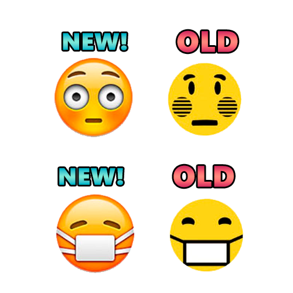

# 😳👉👈 Emoji Replacer [Google Chrome]
> 🛠️ Extension Description:
This Google Chrome extension replaces the standard emojis from your operating system with MacOs-style emojis on all websites.

> 🛠️ Описание расширения:
Это расширение для Google Chrome заменяет стандартные эмодзи вашей операционной системы на эмодзи в стиле MacOs (Apple) на всех сайтах.

### 📥 Installation Instructions:

> 1. Download the archive.
> 2. Unpack img.rar (place the "img" folder in the root directory with the other files).
> 3. Go to chrome://extensions/ in your browser.
> 4. Click "Load unpacked extension" and select the folder with the extension.
> 5. Enjoy!

### 📥 Инструкции по установке:

> 1. Скачайте архив.
> 2. Распакуйте img.rar (папку "img" поместите в корневой каталог с другими файлами).
> 3. Зайдите на страницу chrome://extensions/ в вашем браузере.
> 4. Нажмите "Загрузить распакованное расширение" и выберите папку с расширением.
> 5. Готово!
